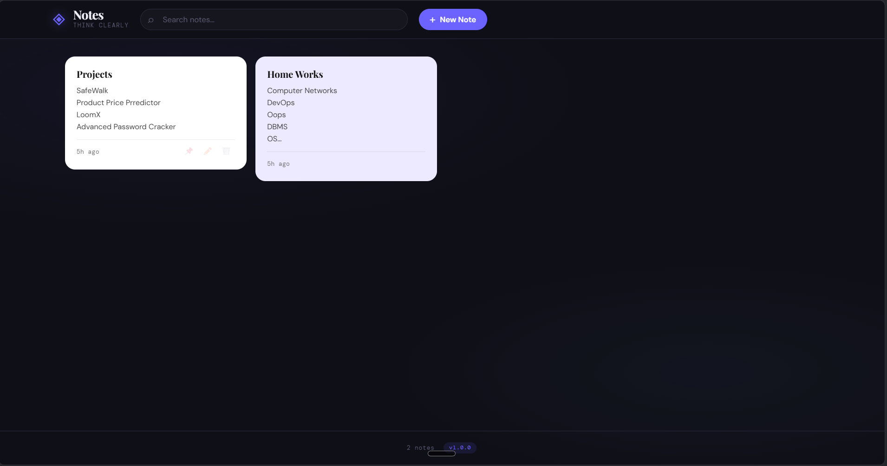
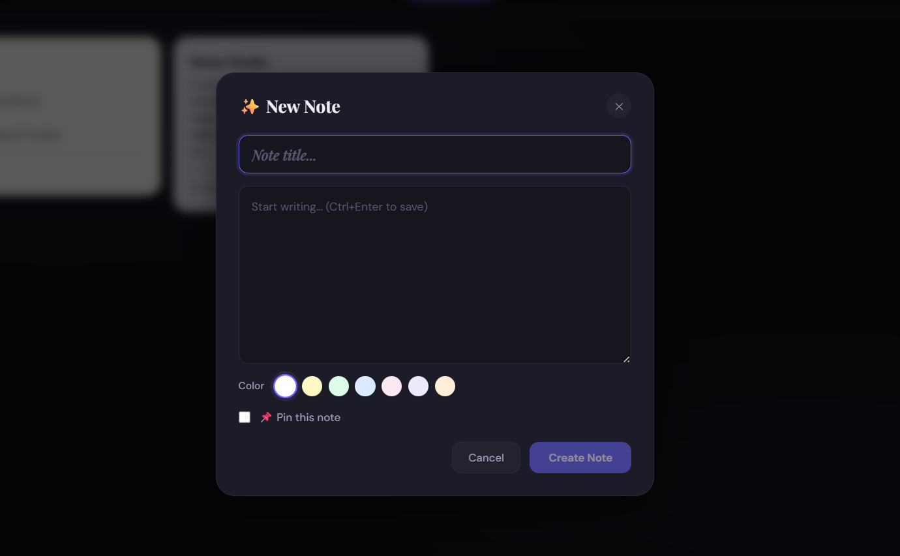

# ◈ Notes App CI/CD

> **A portfolio-worthy DevOps project** — Full-stack Notes application with automated
> CI/CD using GitHub, Jenkins on Windows, Docker, and WSL (Bash scripts).
>
> Every time you push code to GitHub → Jenkins auto-detects it → builds, tests, and deploys → your app is live and updated. Zero manual steps.

### Dashboard


### Note Taking Tab

---

## 📋 Table of Contents

1. [What You'll Build](#what-youll-build)
2. [Architecture Overview](#architecture-overview)
3. [Project Structure](#project-structure)
4. [Tech Stack](#tech-stack)
5. [Prerequisites](#prerequisites)
6. [Part A — First-Time Setup (Complete Guide)](#part-a--first-time-setup)
   - [A1. Enable WSL on Windows](#a1-enable-wsl-on-windows)
   - [A2. Run the Setup Script](#a2-run-the-setup-script)
   - [A3. Push Code to GitHub](#a3-push-code-to-github)
   - [A4. Install Jenkins on Windows](#a4-install-jenkins-on-windows)
   - [A5. Configure Jenkins Pipeline](#a5-configure-jenkins-pipeline)
   - [A6. Expose Jenkins with ngrok](#a6-expose-jenkins-with-ngrok)
   - [A7. Configure GitHub Webhook](#a7-configure-github-webhook)
7. [Part B — Everyday Usage](#part-b--everyday-usage)
8. [CI/CD Pipeline Explained](#cicd-pipeline-explained)
9. [API Reference](#api-reference)
10. [Docker Commands](#docker-commands)
11. [Troubleshooting](#troubleshooting)
12. [Portfolio Notes](#portfolio-notes)

---

## What You'll Build

A **Notes Web Application** where you can:
- ✅ Create, edit, and delete notes
- 🎨 Color-code notes (7 colors)
- 📌 Pin important notes to the top
- 🔍 Search notes in real time
- 💾 Persistent storage (SQLite database)

**AND** a complete **automated CI/CD pipeline** where:
- You write code on Windows (VS Code)
- Push to GitHub
- Jenkins automatically runs tests, builds Docker images, and deploys
- Your live app updates automatically — you don't touch the server


---

## Architecture Overview

```
┌─────────────────────────────────────────────────────────────────┐
│                    YOUR WINDOWS MACHINE                         │
│                                                                 │
│  ┌──────────┐   git push   ┌─────────────┐                    │
│  │ VS Code  │ ───────────► │   GitHub    │                    │
│  │(Windows) │              │    Repo     │                    │
│  └──────────┘              └──────┬──────┘                    │
│                                   │ webhook (HTTP POST)        │
│                            ┌──────▼──────┐                    │
│                            │    ngrok    │ ← tunnels to       │
│                            │  (tunnel)   │   the internet     │
│                            └──────┬──────┘                    │
│                                   │                            │
│                            ┌──────▼──────┐                    │
│                            │   Jenkins   │ ← :8080 Windows    │
│                            │  (Windows)  │                    │
│                            └──────┬──────┘                    │
│                                   │ runs pipeline (via WSL)   │
│  ┌────────────────────────────────▼──────────────────────┐   │
│  │                      WSL (Ubuntu)                      │   │
│  │                                                        │   │
│  │  ┌──────────┐  ┌──────────────┐  ┌──────────────┐   │   │
│  │  │  Tests   │  │ Docker Build │  │    Deploy    │   │   │
│  │  │npm test  │  │  (images)    │  │ docker-compose│   │   │
│  │  └──────────┘  └──────────────┘  └──────┬───────┘   │   │
│  │                                          │            │   │
│  │  ┌───────────────────────────────────────▼────────┐  │   │
│  │  │                   Docker                       │  │   │
│  │  │  ┌─────────────────┐   ┌─────────────────────┐│  │   │
│  │  │  │    Frontend     │   │      Backend        ││  │   │
│  │  │  │  React + Nginx  │   │  Node.js + SQLite   ││  │   │
│  │  │  │   Port 3000     │   │     Port 5000       ││  │   │
│  │  │  └─────────────────┘   └─────────────────────┘│  │   │
│  │  └────────────────────────────────────────────────┘  │   │
│  └────────────────────────────────────────────────────────┘   │
│                                                                 │
│  Browser: http://localhost:3000  (Notes App)                   │
│           http://localhost:8080  (Jenkins Dashboard)           │
└─────────────────────────────────────────────────────────────────┘
```

---

## Project Structure

```
notes-app-cicd/
│
├── backend/                    ← Node.js + Express API
│   ├── src/
│   │   ├── index.js            ← Main server (routes, middleware, health)
│   │   ├── database.js         ← SQLite connection + schema
│   │   └── routes/
│   │       └── notes.js        ← CRUD endpoints for notes
│   ├── tests/
│   │   └── notes.test.js       ← Jest + Supertest API tests
│   ├── Dockerfile              ← Multi-stage production Docker image
│   ├── .env.example            ← Environment variable template
│   └── package.json
│
├── frontend/                   ← React Notes Application
│   ├── src/
│   │   ├── App.js              ← Main app component (state, CRUD logic)
│   │   ├── App.css             ← App-level styles (layout, header, grid)
│   │   ├── index.js            ← React entry point
│   │   ├── index.css           ← Global design system (CSS variables, reset)
│   │   ├── components/
│   │   │   ├── NoteCard.js     ← Individual note card with actions
│   │   │   ├── NoteCard.module.css
│   │   │   ├── NoteForm.js     ← Create/edit note modal
│   │   │   └── NoteForm.module.css
│   │   └── services/
│   │       └── api.js          ← API client (fetch wrapper)
│   ├── public/
│   │   └── index.html          ← HTML shell with fonts
│   ├── nginx.conf              ← Nginx config (serves React + proxies API)
│   ├── Dockerfile              ← Multi-stage: build React → serve with nginx
│   └── package.json
│
├── scripts/                    ← Bash automation scripts
│   ├── setup-wsl.sh            ← One-time setup (Node, Docker, project deps)
│   ├── deploy.sh               ← Build + deploy via Docker Compose
│   ├── health-check.sh         ← Check if all services are running
│   └── rollback.sh             ← Rollback to a previous image version
│
├── jenkins/
│   └── JENKINS_SETUP.md        ← Step-by-step Jenkins configuration guide
│
├── Jenkinsfile                 ← Declarative CI/CD pipeline definition
├── docker-compose.yml          ← Multi-service Docker orchestration
├── .gitignore                  ← Git ignore (node_modules, .env, etc.)
└── README.md                   ← This file
```

---

## Tech Stack

| Layer        | Technology              | Purpose                                    |
|--------------|-------------------------|--------------------------------------------|
| Frontend     | React 18                | Notes UI (create, edit, delete, search)    |
| Frontend     | CSS Modules             | Scoped component styling                   |
| Backend      | Node.js + Express       | REST API server                            |
| Database     | SQLite (better-sqlite3) | Persistent note storage (no setup needed)  |
| Testing      | Jest + Supertest        | Backend API tests with coverage            |
| Container    | Docker (multi-stage)    | Reproducible, isolated builds              |
| Orchestration| Docker Compose          | Multi-container management                 |
| Reverse Proxy| Nginx                   | Serve React + proxy API calls              |
| CI/CD        | Jenkins                 | Automated build/test/deploy pipeline       |
| Tunneling    | ngrok                   | Expose local Jenkins to GitHub webhooks    |
| Runtime      | WSL (Ubuntu 22.04)      | Run Linux tools on Windows                 |
| Shell        | Bash                    | Automation scripts                         |

---

## Prerequisites

You need a Windows PC with:
- Windows 10 version 2004+ or Windows 11
- 8GB RAM minimum (16GB recommended)
- 20GB free disk space
- Internet connection
- A GitHub account (free) → https://github.com

---

## Part A — First-Time Setup

> **Do this once.** After setup, you only need Part B every time you push code.

---

### A1. Enable WSL on Windows

WSL (Windows Subsystem for Linux) lets you run Linux/Ubuntu on Windows.

**Open PowerShell as Administrator** (right-click → Run as administrator):

```powershell
# Enable WSL and Virtual Machine Platform
wsl --install

# This installs Ubuntu 22.04 by default
# Restart your computer when prompted
```

After restart, Ubuntu will finish installing. Set a username and password when prompted.

> **Tip:** You can open WSL anytime by searching "Ubuntu" in the Start menu, or typing `wsl` in Command Prompt.

**Verify WSL works:**
```bash
# In the Ubuntu/WSL terminal:
cat /etc/os-release   # Should show Ubuntu
uname -r              # Should show Linux kernel
```

---

### A2. Run the Setup Script

This script installs everything you need: Node.js, Docker, Git config, and runs
the first build of the Notes App.

**In your WSL terminal:**

```bash
# 1. Navigate to your project (assuming you have the files in Windows)
#    Windows C:\ drive is accessible at /mnt/c/ in WSL
cd /mnt/c/Users/YOUR_WINDOWS_USERNAME/notes-app-cicd

# 2. Make scripts executable
chmod +x scripts/*.sh

# 3. Run the setup script
bash scripts/setup-wsl.sh
```

> The script takes 5–10 minutes on first run. It will ask for your Git name/email.

**After setup, verify the app is running:**
```bash
curl http://localhost:5000/health   # Should return JSON
```

Open your browser → **http://localhost:3000** — you should see the Notes App! 🎉

---

### A3. Push Code to GitHub

Now connect your project to GitHub so Jenkins can detect your changes.

```bash
# In WSL terminal, inside your project folder:
cd /mnt/c/Users/YOUR_USERNAME/notes-app-cicd

# Initialize git (if not already done)
git init
git add .
git commit -m "feat: initial Notes App CI/CD project"

# Create a repo on GitHub first (go to github.com → New repository)
# Name it: notes-app-cicd  (keep it public for free webhooks)
# Then connect:
git remote add origin https://github.com/YOUR_USERNAME/notes-app-cicd.git
git branch -M main
git push -u origin main
```

> Your code is now on GitHub. Every future push will trigger the CI/CD pipeline.

---

### A4. Install Jenkins on Windows

Jenkins runs on Windows and orchestrates the pipeline.

#### 4a. Install Java (Jenkins requires it)

Download Java 17 from: https://adoptium.net/temurin/releases/

- Choose: **Windows x64 MSI** for Java 17 LTS
- Install with default settings

Verify:
```cmd
java -version
# Should show: openjdk version "17..."
```

#### 4b. Install Jenkins

1. Go to: https://www.jenkins.io/download/
2. Download **Jenkins LTS** for Windows (.msi)
3. Run the installer
4. Accept defaults — Jenkins installs as a Windows Service on **port 8080**
5. When prompted, get the initial password from the file shown
6. Open: **http://localhost:8080**
7. Paste the initial admin password
8. Click **"Install suggested plugins"** (this takes a few minutes)
9. Create your admin username/password
10. Click **"Save and Finish"**

#### 4c. Install Extra Jenkins Plugins

Go to: **Manage Jenkins → Plugins → Available plugins**

Search and install (tick the checkbox, then "Install"):
- `GitHub Integration Plugin`
- `AnsiColor`

After installing → click **"Restart Jenkins when installation is complete"**

#### 4d. Configure Jenkins Shell to Use WSL

Jenkins needs to run Linux/bash commands via WSL:

1. **Manage Jenkins → Configure System**
2. Scroll to **"Shell"** section
3. Set Shell executable:
   ```
   C:\Windows\System32\wsl.exe
   ```
4. Click **Save**

---

### A5. Configure Jenkins Pipeline

#### 5a. Add GitHub Credentials (for private repos)

Skip this if your repo is public.

1. **Manage Jenkins → Credentials → (global) → Add Credentials**
2. Kind: **Username with password**
3. Username: your GitHub username
4. Password: your GitHub Personal Access Token (create at github.com → Settings → Developer settings → Tokens)
5. ID: `github-credentials`

#### 5b. Create the Pipeline Job

1. Click **"New Item"** on Jenkins dashboard
2. Item name: `notes-app-cicd`
3. Select **"Pipeline"** → click **OK**

**Configure the job:**

**General section:**
- ✅ Check **"GitHub project"**
- Project URL: `https://github.com/YOUR_USERNAME/notes-app-cicd/`

**Build Triggers section:**
- ✅ Check **"GitHub hook trigger for GITScm polling"**

**Pipeline section:**
- Definition: **"Pipeline script from SCM"**
- SCM: **Git**
- Repository URL: `https://github.com/YOUR_USERNAME/notes-app-cicd.git`
- Credentials: (select your credentials, or none for public repo)
- Branch Specifier: `*/main`
- Script Path: `Jenkinsfile`

Click **Save**.

---

### A6. Expose Jenkins with ngrok

GitHub needs to send webhooks to your local Jenkins. ngrok creates a public URL
that tunnels to your local machine.

#### 6a. Install ngrok

1. Go to: https://ngrok.com → Sign up for free
2. Download ngrok for Windows
3. Extract `ngrok.exe` somewhere (e.g., `C:\ngrok\ngrok.exe`)
4. Add your auth token (shown in ngrok dashboard):
   ```cmd
   ngrok config add-authtoken YOUR_TOKEN_HERE
   ```

#### 6b. Start ngrok

Open a **new Command Prompt** (keep this running always during development):

```cmd
ngrok http 8080
```


You'll see output like:
```
Forwarding   https://abc123def456.ngrok-free.app -> http://localhost:8080
```


📝 **Copy the HTTPS URL** — you'll need it in the next step.

> ⚠️ The ngrok URL changes every restart (free plan). Keep the same terminal open.
> For a permanent URL, upgrade ngrok or use a Static Domain (free tier offers 1).

---

### A7. Configure GitHub Webhook

Now tell GitHub to notify Jenkins on every push.

1. Go to your GitHub repo: `https://github.com/YOUR_USERNAME/notes-app-cicd`
2. Click **Settings** → **Webhooks** → **Add webhook**
3. Fill in:
   - **Payload URL**: `https://abc123def456.ngrok-free.app/github-webhook/`
     *(your ngrok URL + `/github-webhook/` — trailing slash is required!)*
   - **Content type**: `application/json`
   - **Secret**: leave blank (or set one and add to Jenkins credentials)
   - **Which events?**: ✅ Just the push event
4. Click **"Add webhook"**

GitHub sends a test ping. You should see a **green checkmark ✅** next to the webhook.


#### Verify It Works

```bash
# In WSL terminal:
echo "# CI/CD test" >> README.md
git add README.md
git commit -m "test: trigger first automated pipeline"
git push origin main
```


Go to **http://localhost:8080** → watch your `notes-app-cicd` job start automatically!

**The pipeline will:**
1. 📥 Checkout your latest code
2. 🧪 Run backend tests
3. 🧪 Run frontend tests
4. 🐳 Build Docker images
5. 🚀 Deploy with docker-compose
6. ❤️ Health check the live app
7. 🧹 Clean up old Docker resources

After it completes (3–5 min), open **http://localhost:3000** — your updated app is live! 🎉

---

## Part B — Everyday Usage

> **This is your daily workflow.** The CI/CD is already set up. Just code and push.

### Daily Developer Workflow

```bash
# 1. Open VS Code in your project
code .

# 2. Make your changes (edit notes, fix bugs, add features)

# 3. Save and commit
git add .
git commit -m "feat: add note color categories"

# 4. Push to GitHub → CI/CD starts automatically!
git push origin main

# 5. Watch the pipeline (optional):
#    → http://localhost:8080/job/notes-app-cicd/
#    → Check console output for real-time logs
```

**That's it.** Jenkins handles everything else.

### Useful Commands

```bash
# Check if the app is running
bash scripts/health-check.sh

# View live app logs
docker compose logs -f

# View only backend logs
docker compose logs -f backend

# View only frontend logs
docker compose logs -f frontend

# Stop the app
docker compose down

# Restart the app manually
bash scripts/deploy.sh

# Rollback to a previous version
bash scripts/rollback.sh

# SSH into running backend container
docker exec -it notes-backend sh

# List all Docker images (your version history)
docker images | grep notes
```

### Making Changes That Trigger Deployment

Any push to `main` triggers the full pipeline:

```bash
# Feature change
git add .
git commit -m "feat: add note search highlighting"
git push

# Bug fix
git commit -m "fix: notes not saving on mobile"
git push

# Style update
git commit -m "style: improve dark mode colors"
git push
```

---

## CI/CD Pipeline Explained

The `Jenkinsfile` defines 7 stages that run in sequence:

```
GitHub Push
    │
    ▼
📥 Stage 1: CHECKOUT
    └─ Gets latest code from GitHub
    │
    ▼
🧪 Stage 2: BACKEND TESTS
    └─ npm ci → npm test (Jest + Supertest)
    └─ Tests: health endpoint, CRUD operations, error handling
    │
    ▼
🧪 Stage 3: FRONTEND TESTS
    └─ npm ci → npm test (React Testing Library)
    │
    ▼  (only if tests pass)
🐳 Stage 4: DOCKER BUILD
    └─ docker build backend → notes-backend:VERSION + :latest
    └─ docker build frontend → notes-frontend:VERSION + :latest
    │
    ▼
🚀 Stage 5: DEPLOY
    └─ docker compose down (stop old containers)
    └─ docker compose up -d (start new containers)
    │
    ▼
❤️ Stage 6: HEALTH CHECK
    └─ Poll GET /health until backend responds (10 retries × 5s)
    └─ Check frontend HTTP 200
    └─ Print health status JSON
    │
    ▼
🧹 Stage 7: CLEANUP
    └─ Remove old Docker images (> 48 hours)
    └─ Clean unused volumes
    │
    ▼
✅ SUCCESS (or ❌ FAILURE with logs)
```

**If any stage fails**, the pipeline stops and shows the error. Deployment only
happens if tests pass — you can never accidentally deploy broken code.

---

## API Reference

Base URL: `http://localhost:5000`

### Health

| Method | Endpoint  | Response                                    |
|--------|-----------|---------------------------------------------|
| GET    | `/health` | `{ status, version, uptime, timestamp }`    |

### Notes

| Method | Endpoint          | Description           | Body                                       |
|--------|-------------------|-----------------------|--------------------------------------------|
| GET    | `/api/notes`      | List all notes        | —                                          |
| GET    | `/api/notes?search=q` | Search notes     | —                                          |
| GET    | `/api/notes/:id`  | Get single note       | —                                          |
| POST   | `/api/notes`      | Create note           | `{ title, content, color, pinned }`        |
| PUT    | `/api/notes/:id`  | Update note           | `{ title, content, color, pinned }`        |
| DELETE | `/api/notes/:id`  | Delete note           | —                                          |

**Example — Create a note:**
```bash
curl -X POST http://localhost:5000/api/notes \
  -H "Content-Type: application/json" \
  -d '{"title": "My Note", "content": "Hello World!", "color": "#fef9c3"}'
```

**Example — Search notes:**
```bash
curl "http://localhost:5000/api/notes?search=hello"
```

---

## Docker Commands

```bash
# Start everything
docker compose up -d

# Stop everything
docker compose down

# Rebuild and start (after code changes, without Jenkins)
docker compose up -d --build

# View running containers
docker compose ps

# Follow all logs
docker compose logs -f

# Follow specific service
docker compose logs -f backend
docker compose logs -f frontend

# Restart a single service
docker compose restart backend

# Enter a container
docker exec -it notes-backend sh
docker exec -it notes-frontend sh

# List images
docker images | grep notes

# Remove all Notes images (reset)
docker rmi notes-backend notes-frontend 2>/dev/null || true

# Remove data volume (WARNING: deletes all notes!)
docker volume rm notes_app_data
```

---

## Troubleshooting

### App not loading at http://localhost:3000

```bash
# Check containers are running
docker compose ps

# If not running, start them
docker compose up -d

# Check logs for errors
docker compose logs frontend
docker compose logs backend
```

### Jenkins pipeline fails at "Docker Build" stage

```bash
# In WSL — make sure Docker is running
sudo service docker start
docker info  # Should show server info, not error
```

### Jenkins doesn't trigger on push

1. Check ngrok is still running (it must stay open)
2. Go to GitHub → repo Settings → Webhooks → click your webhook → "Recent Deliveries"
3. Look for a red X — click it to see the error
4. Common fix: ngrok URL changed → update the webhook with new URL

### Permission denied on scripts

```bash
# In WSL:
chmod +x scripts/*.sh
git add scripts/
git commit -m "fix: script permissions"
git push
```

### WSL can't connect to Docker

```bash
# Start Docker manually
sudo service docker start

# Or add this to your ~/.bashrc for auto-start:
echo 'sudo service docker start >/dev/null 2>&1' >> ~/.bashrc
```

### Port 3000 or 5000 already in use

```bash
# Find what's using the port
lsof -i :3000
lsof -i :5000

# Kill the process (replace PID)
kill -9 <PID>

# Or just stop all docker containers
docker compose down
docker stop $(docker ps -q) 2>/dev/null || true
```

### SQLite database issues

```bash
# Database is stored in a Docker volume
# Check if volume exists
docker volume ls | grep notes

# Delete and recreate (WARNING: loses all notes data)
docker compose down -v
docker compose up -d
```

---

## Portfolio Notes

This project demonstrates these DevOps skills:

| Skill                   | How it's demonstrated                                    |
|-------------------------|----------------------------------------------------------|
| **CI/CD**               | Jenkinsfile with 7 automated stages                      |
| **Docker**              | Multi-stage builds for both frontend and backend         |
| **Docker Compose**      | Multi-container orchestration with health checks         |
| **Linux/Bash**          | 4 professional shell scripts with error handling         |
| **WSL**                 | Running Linux tools natively on Windows                  |
| **Webhook Integration** | GitHub → ngrok → Jenkins automation                      |
| **Testing**             | Jest + Supertest with pipeline gates (no deploy if fail) |
| **REST API**            | Express CRUD API with proper HTTP status codes           |
| **Nginx**               | Reverse proxy config, gzip, caching, SPA routing         |
| **React**               | Modern hooks, CSS Modules, responsive design             |
| **SQLite**              | Lightweight production database with migrations          |
| **Git Workflow**        | Branching, commits, push triggers deployment             |

---

## License

MIT — free to use, modify, and include in your portfolio.

---

> **Built with ❤️ for learning DevOps.** Push code → watch the magic happen.
# CI/CD test
# CI/CD test1
